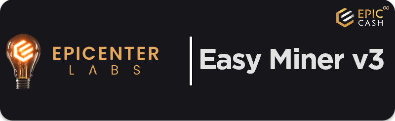

<p align="center">
  
</p>

> Author:  [**@blacktyg3r**](https://t.me/blacktyg3r).
---


Cross-platform and user-friendly mining manager working with the EPIC Blockchain Protocol. 
Its job is to setup, run, collect feedback from mining software and deliver processed data 
via API to front-end interface (GUI).

---
### ABSTRACT

**Easy Miner <sup>v3</sup>** will continue its mission from the previous versions, that is to deliver an **EPIC mining**
manager application **easy to use for everyone**. The **EPIC Proof Of Work** polyphasic design unlocks
multiple ways to mine blocks and can be used with different types of hardware or software, example
scenarios:

```
● Solo mining
● Pool mining (multiple options)
● CPU mining (RandomX)
● GPU mining (ProgPoW)
● ASIC mining (Cuckoo)
● Dual mining (1 algo, 2 coins)
● Multiple operating systems
● Multiple mining software options
```

In order to start mining user have to go through the above checklist and work out which
combination is right for him. It will be different in each case and will depend on rig power (hashrate),
PoW algorithm, hardware manufacturer, location and other smaller factors.

To make **Easy Miner** indeed **easy** , we have to automate this process as much as possible while
maintaining the flexibility of the **EPIC blockchain design**. For this purpose application will collect
required entry data:

```
● Model and make of GPU (automated)
● Model and make of CPU (automated)
● Operating system (automated)
```

This will be used to prepare recommended **mining software**, estimate **rig power** and **yield**.
**Easy Miner** will also help to connect to the right **mining pool**.

Application will **support pool mining** over solo forthe following reasons:
```
● No need for user to host the EPIC node
● No need for user to setup the EPIC wallet before mining
● Suitable for all rigs and machines (solo requires powerful equipment)
● Payouts are made often and income is predictable
```
---

### TECH STACK

Application back-end will be mostly written with the **Python** programming language using its
multiple libraries and frameworks. This app should be considered as a manager, its job is to run,
diagnose 3rd party software and deliver collected data via API.

Front-end would be completely separate and possible to build independently of the back-end
engine. Communication would be through a **local web-server with API endpoints** exposed and
documented.
```
BACK-END:
● Python
● FastAPI, Flask, SQLite
● EPIC Core Software (github.com/epiccash)

FRONT-END:
● HTML/CSS
● JavaScript
● NodeJS
```
---

# Application core elements
- The **Setup-wizard** will provide step-by-step help for the new users, from how to configure mining
software to making an account at the pool website

- The **Pool Dashboard** will provide data for better understanding how to help network with spreading
hash power evenly between available pools. Users will easily switch between pools to i.e. compare
efficiency.

- The **Mining Calculator** will provide estimates about rig yield and will help to work out electricity and
other costs for more precise calculations.

- The **Update Manager** will take care of any updates - **Easy Miner** is managing multiple independent
software, this manager will check them and update whenever needed.
---

#### 1. Hardware and OS detection
- Collect data:
    - Model and make of GPU 
    - Model and make of CPU 
    - Operating system

#### 2. Setup-wizard
- Collect data:
    - Hardware & software report from database
    - User input (i.e. pool credentials)

#### 3. Update manager
#### 4. Pool Dashboard
#### 5. Mining Calculator
- Collect data:
    - Rig details (from user or database)
    - Blockchain network stats (from explorer API)
    - Crypto market stats (from coingecko API)
#### 7. GUI interface


---
## Donations and Support
Support and donation are welcome, more details via Telegram: [**@blacktyg3r**](https://t.me/blacktyg3r).

- Native EPIC:
    - Stack Wallet: ```esZ7pubuHN4Dyn8WsCRjzhe12ZtgHqmnthGoopA1iSskm2xwXcKK```
    - GUI/CLI Wallet: ```https://blacktyg3r.com/pay```
- VITE Chain:
    - ```vite_d3f478a11bb149c4d140ea29dbfceba5b5315c04561d355c12```

---
Developed by [BT LABS](https://blacktyg3r.com) @ 2023

